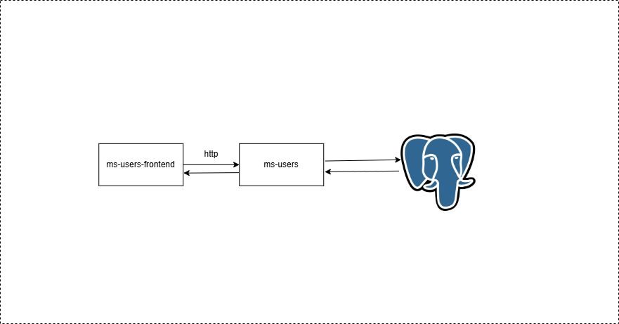
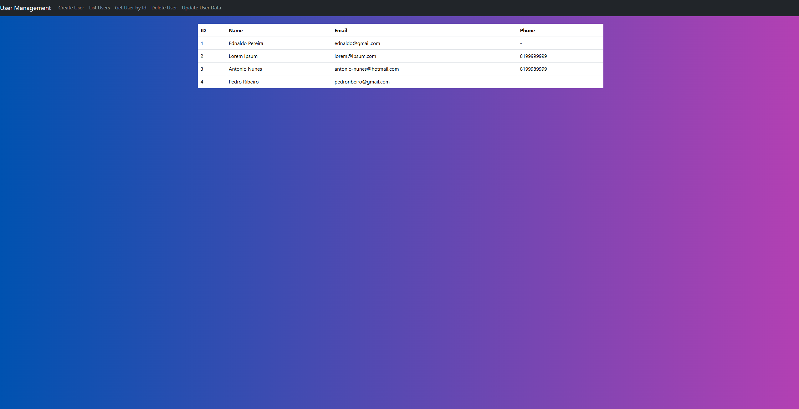

# MS-USERS-FRONTEND


## Description
Web page responsible for managing the user CRUD.



## Tech Stack
1. [React](https://react.dev/)
2. [Axios](https://axios-http.com/)

## Dependencies
This service depends on the ms-users microservice, please read the ms-users documentation to get it running correctly.

## Local Variables
See [.env.sample](.env.sample) file

## Running Application

Install dependencies

```shell
npm i
```

Start the application

```shell
npm run start
```

## Application Screen
